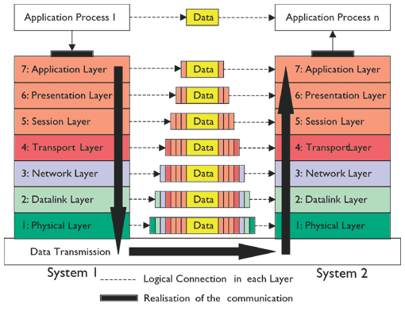

# Introduction to Computer Networks

> This handout only deals with the most basic topics about Computer Networks,
> please refer to EE3650/COM5310 for further information.
> If there's any problem with this file, please note me. Thank you.

## Prerequisites
* basic knowledge about HTML/JavaScript and better how they're executed on browsers
* knowing how to let files available on your own server/website
* (optional) programming language: C/C++
* (optional) hub/switch, router, port
* (optional) experience in PHP/MySQL, or setting up XAMP/LAMP, etc.


## Abstract 
This handout gives an introductory version of Computer Networks,
which is a useful subject/knowledge of great importance.
We'll first talk about the historical perspective of WWW,
giving us more insight into this interesting field,
and thus it provide us with the reason why we need this and how we do it.
We then turn our interest to Open System Interconnection (OSI), which is a very important concept
that results in today's TCP/IP and other network frameworks.
The main topic is IP and the overall structure of Internet (connections).
Finally, this handout will end up in something about UDP, DNS, TCP, etc.

> Additional information is provided <a href="Presentation_20150708.pdf">here</a> for further references.
> Note that this PDF is only for students in this club.
> You can also visit vBird's website for tons of information relating to this topic.

#### Contents

* Topic 1 -- Historical Perspective
  * Origination of World-Wide Web (WWW)
  * "A Patch Server" -- Apache 
  * IEEE Standards
* Topic 2 -- Introduction to Open System Interconnection (OSI)
  * Components Comprising the Web
  * Over View of OSI Layers
  * Simplification of OSI and Relating Motivation
* Topic 3 -- Transmission Control Protocol (TCP)
  * Three-Way Handshake
  * User Datagram Protocol (UDP)
  * (optional) Sockets
* Topic 4 -- Hypertext Transmission Protocol (HTTP) and HTTPS
  * Introduction to HTTP
  * Ports Commonly Used
  * Localhost
* Topic 5 -- Internet Protocol (IP)
  * IPv4 and IPv6
  * Domain
  * Netmask
  * Gateway/Router
  * Domain Name Server (DNS)
  * Dynamic Host Configuration Protocol (DHCP)
* Topic 6 -- Netwrok Hardwares
  * Switch/Hub/Router
  * Sample Network Structure: as a Company
* Topic 7 -- Other Relating Topics
  * Multiple Sense Multiple Access with Collision Detection (CSMA/CD)
  * (Reverse) Address Resolution Protocol (RARP/ARP)
  * Internet Control Message Protocol (ICMP)


## Topic 1 -- Historical Perspective
> Opening Questions: </br>
> What's the origin of "web"? </br>
> Why we have these networks protocol now? </br>
> What is a "server"? </br>
> Are there any standards regarding with various protocols? </br>


#### 1.1 Origination of World-Wide Web (WWW)
We now can see Internet everywhere in our lives, it may be surprising that
this is created/invented for military purposes during cold war times.
In the 1980's, incorporating TCP/IP protocols, a "net" of computers are able to communicate with each other.
The world-wide web (WWW) is then introduced to improve science researches.
That's the same time when HTTP is created to share researches among scientists.
Moreover, WWW and E-mail back in the 1980's and 1990's, respectively, made TCP/IP famous.
Interested reader can google "APARNET" for further information.

#### 1.2 "A Patch Server" -- Apache 
See HTTPd (HTTP daemon): https://en.wikipedia.org/wiki/Httpd . 
Back then, in order to actuate the HTTP protocol,
NCSA designed HTTPd to use as server, and then Netscape initiated its own server and browser for users.
However, since the server of Netscape's was too expensive, the mainstream was HTTPd server.
As time went by, due to lack of update of HTTPd server,
a society issued a project to enhance/improve it, named it "A Patch Server",
nicknamed "Apache", meaning this is a server with lots of modification.

#### 1.3 IEEE Standards
Thanks to hakers, the standard for Internet and Ethernet was established by IEEE, remaining as the standard.
To look at more details, please visit http://linux.vbird.org/linux_server/0360apache.php .

## Topic 2 -- Introduction to Open System Interconnection (OSI)
> Opening Questions: </br>
> What's the prototype of TCP/IP protocols?　</br>
> What elements make up to a basic but complete network? </br>
> Why OSI and its "descendants" are of great importance? </br>

#### 2.1 Components Comprising the Web
* Node: devices with IP
* Server: response
* Client: e.g. workstation
* Router/Gateway: connecting between two different interfaces, combining different groups of devices

#### 2.2 Over View of OSI Layers
At the beginning, we devide the networking application into seven layers,
with Layer 1 closest to the hardware and Layer closest to software, so to speak.
The overall structure is shown below.</br>
</br>
We're not going into details of these seven scray layers, 
please visit http://www.webopedia.com/quick_ref/OSI_Layers.asp for further reference.

#### 2.3 Simplification of OSI and Relating Motivation
The complicated seven-layer OSI model was simplified to a four-layer structure.
Basically, some similar functioning layers are combined, </br>
1. Network Layer: data transmitted into devices </br>
2. Internet Layer: IP header, routing information </br>
3. Transport Layer: TCP/UDP, data flow </br>
4. Application Layer: interfaces </br>

These four-layer structure forms the consisting TCP/IP protocols,
which greatly simplifies programming efforts. (less "rigorous")
With the addition of WWW and E-mail, this has become our current Internet structure.

## Topic 3 -- Transmission Control Protocol (TCP)
> Opening Questions: </br>
> How to define the way of communication?
> What's a "packet"?
> What information is needed for the packages to be transferred to the correct destinations?

#### 3.1 Three-Way Handshake
How's data transmitted from one place to another? Definitely, the source and destination "address" is needed.
(the concept of "address" will be clear when we talk about IP) 
Some additional controling codes are also needed for advanced functionalities.
Furthermore, when the data is transferred from one place to another,
there will definitely be some bits being contaminated, i.e., revesed or even missing.
As a result, some correcting mechanisms should be implemented inside the packet.
These additional bits resembles the concept of Error Correcting Codes (ECC),
more on ECC: http://www.qrstuff.com/blog/2011/12/14/qr-code-error-correction .
For more information about the bits added, please google "TCP Header".

Three way handshake is the concept of data transfer based on "both aggreement".
One initiates the sending request with a specific "Sequence Numner".
Then the server will send a packet with special bits added and a new Sequence Number embedded back to the user.
If the user send another packet back to the server and it's received by the server, connection's established.

#### 3.2 User Datagram Protocol (UDP)
UDP is faster in terms of data transfer since it does not have sever/response check.
This is applicable in LIVE media streams.

#### 3.3 (optional) Sockets
Here comes the interesting part. Once you set up your own server on your PC/laptop,
you can try out "BSD Unix Socket": https://en.wikipedia.org/wiki/Berkeley_sockets .
Some other comparision between TCP, Sockets, and Internet Sockets (not really that important):
http://stackoverflow.com/questions/22897972/unix-vs-bsd-vs-tcp-vs-internet-sockets .
You can use socket to build your own chat room!
Here are the facts that you need to know:
* two programs needed: one as client and the other acts as server
* programming language used: C/C++, Java, PHP, etc.
* to construct multi-user server, you need to know mutex and pthread (for example, in C)
To start chatting, you need to specify the IP address and the port that the server will listen to (to be discussed),
and transfer data by pairs of read() and write(). Here's some code abstracted from my project:

Server.c (return 1 on error for now)
```
	// creating TCP socket
	iSockFD=socket(AF_INET,SOCK_STREAM,0);
	if (iSockFD<0)  return 1;

	setsockopt(iSockFD,SOL_SOCKET,SO_REUSEADDR,(const char*)&n,sizeof(n));
	memset((char*)&sLocalAddr,0,sizeof(sLocalAddr));
	sLocalAddr.sin_family=AF_INET;
	//sLocalAddr.sin_len=sizeof(sLocalAddr);
	sLocalAddr.sin_port=htons(5050);
	sLocalAddr.sin_addr.s_addr=htonl(INADDR_ANY);
	iAddrSize=sizeof(sLocalAddr);

	// binding to Server
	iStatus=bind(iSockFD,(struct sockaddr*)&sLocalAddr,iAddrSize);
	if (iStatus<0)  return 1;
	//printf("Bind Success\n");

	// start listening to port 5001
	iStatus=listen(iSockFD,20);  // 5 or SOMAXCONN
	if (iStatus!=0)  return 1;
	printf("Listening to Port 5050\n");
```

For beginners, it's better to start with PHP sockets since they're much easier: 
http://php.net/manual/en/book.sockets.php .


## Topic 4 --  Hypertext Transmission Protocol (HTTP) and HTTPS
#### 4.1 Introduction to HTTP
#### 4.2 Ports Commonly Used
#### 4.3 Localhost

## Topic 5 -- Internet Protocol (IP)
#### 5.1 IPv4 and IPv6
#### 5.2 Domain
#### 5.3 Netmask
#### 5.4 Gateway/Router
#### 5.5 Domain Name Server (DNS)
#### 5.6 Dynamic Host Configuration Protocol (DHCP)

## Topic 6 -- Netwrok Hardwares
#### 6.1 Switch/Hub/Router
#### 6.2 Sample Network Structure: as a Company

## Topic 7 -- Other Relating Topics
#### 7.1 Multiple Sense Multiple Access with Collision Detection (CSMA/CD)
#### 7.2 (Reverse) Address Resolution Protocol (RARP/ARP)
#### 7.3 Internet Control Message Protocol (ICMP)
